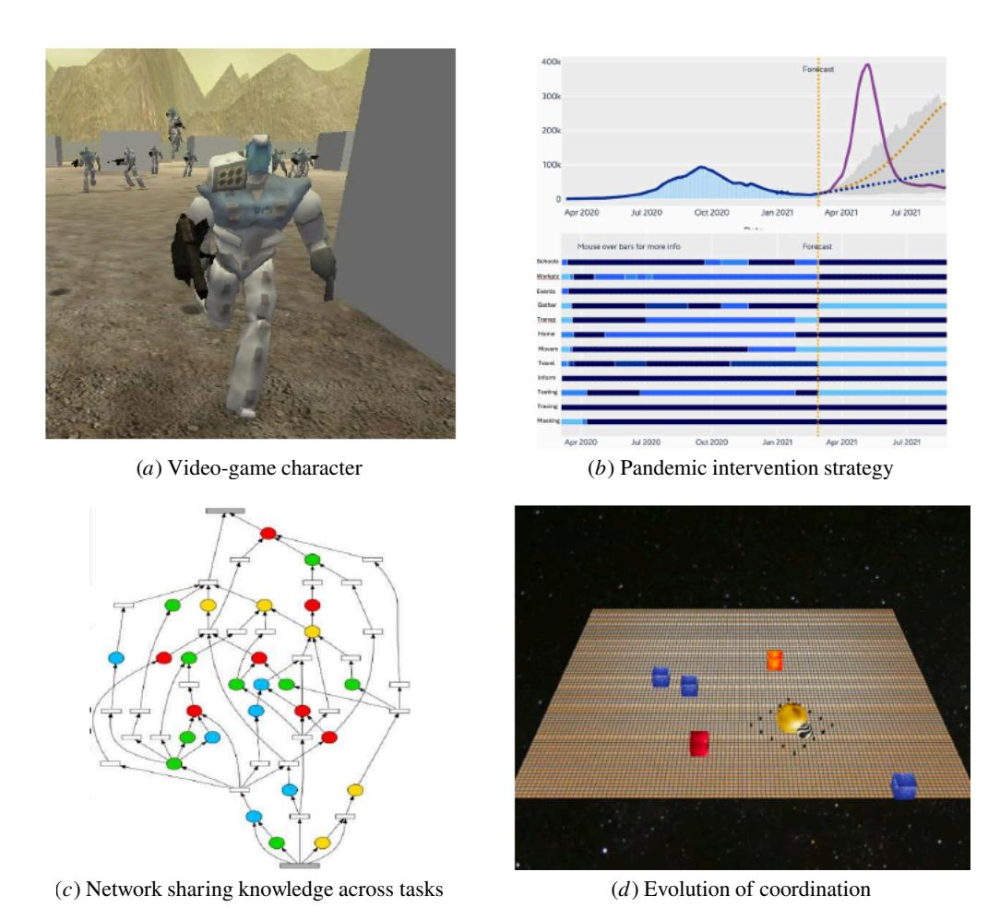
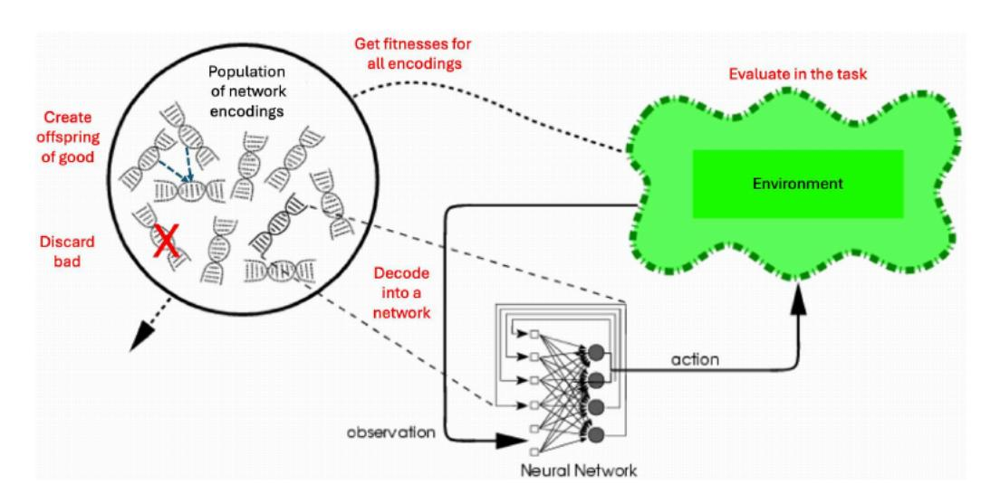
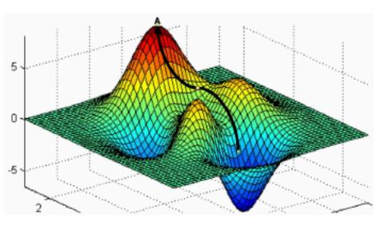
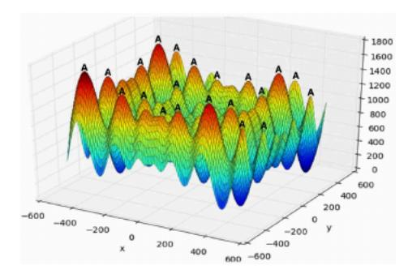
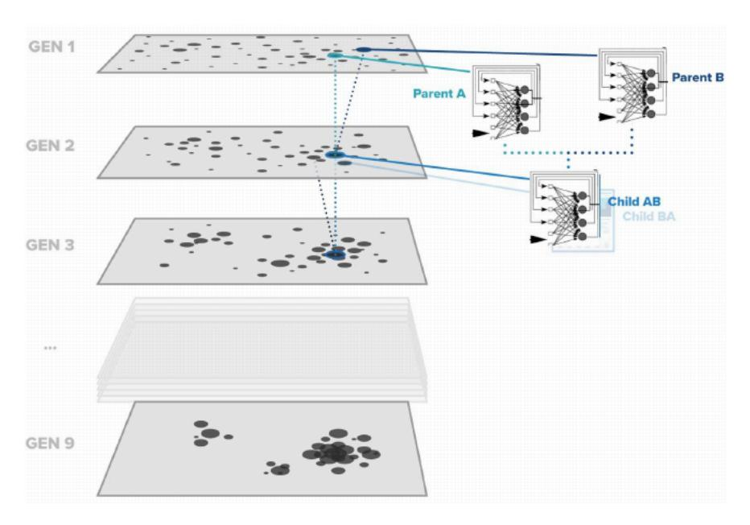
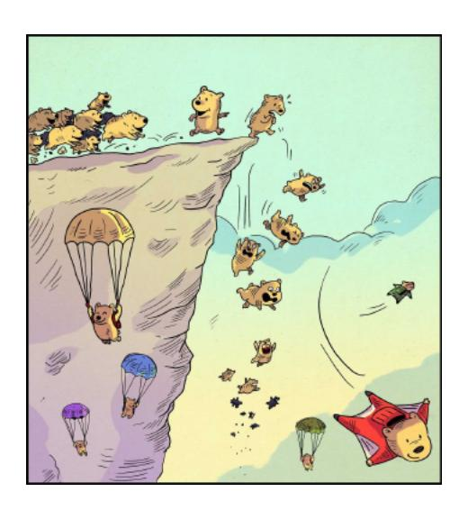
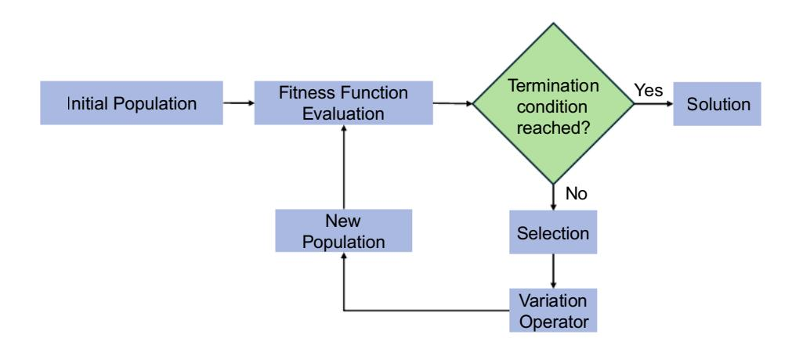

# NEUROEVOLUTION

Harnessing Creativity in Al Agent Design


Sebastian Risi, Yujin Tang, David Ha, Risto Miikkulainen

# **Contents**

|   | Foreword |              |                                                                              | vii |
|---|----------|--------------|------------------------------------------------------------------------------|-----|
|   | Online   | Supplement   |                                                                              | x   |
|   | Preface  |              |                                                                              | xi  |
| 1 |          | Introduction |                                                                              | 1   |
|   | 1.1      | Evolving     | Neural<br>Networks                                                           | 3   |
|   | 1.2      | Extending    | Creative<br>AI                                                               | 4   |
|   | 1.3      | Improving    | the<br>World                                                                 | 9   |
|   | 1.4      | Plan<br>for  | the<br>Book                                                                  | 10  |
|   | 1.5      | Plan<br>for  | Hands-on<br>Exercises                                                        | 12  |
|   | 1.6      | Chapter      | Review<br>Questions                                                          | 12  |
| 2 | The      | Basics       |                                                                              | 14  |
|   | 2.1      |              | Evolutionary<br>Algorithms                                                   | 14  |
|   |          | 2.1.1        | Representation                                                               | 16  |
|   |          | 2.1.2        | Population-Based<br>Search                                                   | 17  |
|   |          | 2.1.3        | Selection                                                                    | 18  |
|   |          | 2.1.4        | Variation<br>Operators                                                       | 18  |
|   |          | 2.1.5        | Fitness<br>Evaluation                                                        | 19  |
|   |          | 2.1.6        | Reproduction<br>and<br>Replacement                                           | 19  |
|   |          | 2.1.7        | Termination                                                                  | 20  |
|   | 2.2      | Types        | of<br>Evolutionary<br>Algorithms                                             | 21  |
|   |          | 2.2.1        | Genetic<br>Algorithm                                                         | 21  |
|   |          | 2.2.2        | Evolution<br>Strategy                                                        | 23  |
|   |          | 2.2.3        | Covariance-Matrix<br>Adaptation<br>Evolution<br>Strategy                     | 25  |
|   |          | 2.2.4        | OpenAI<br>Evolution<br>Strategy                                              | 28  |
|   |          | 2.2.5        | Multiobjective<br>Evolutionary<br>Algorithms                                 | 30  |
|   |          | 2.2.6        | Further<br>Evolutionary<br>Computation<br>Techniques                         | 32  |
|   |          | 2.2.7        | Try<br>These<br>Algorithms<br>Yourself                                       | 34  |
|   | 2.3      | Neural       | Networks                                                                     | 36  |
|   |          | 2.3.1        | Feedforward<br>Neural<br>Networks                                            | 36  |
|   |          | 2.3.2        | Training<br>Feedforward<br>Neural<br>Networks<br>with<br>Gradient<br>Descent | 37  |
|   |          | 2.3.3        | Recurrent<br>Neural<br>Networks                                              | 39  |

|   |          | 2.3.4    | Long<br>Short-Term<br>Memory                                              | 40  |
|---|----------|----------|---------------------------------------------------------------------------|-----|
|   |          | 2.3.5    | Convolutional<br>Neural<br>Networks                                       | 42  |
|   |          | 2.3.6    | Transformers                                                              | 44  |
|   | 2.4      |          | Neuroevolution:<br>An<br>Integrated<br>Approach                           | 47  |
|   | 2.5      | Chapter  | Review<br>Questions                                                       | 47  |
| 3 | The      |          | Fundamentals<br>of<br>Neuroevolution                                      | 49  |
|   | 3.1      |          | Neuroevolution<br>Taxonomy                                                | 49  |
|   |          | 3.1.1    | Fixed-Topology<br>Neuroevolution                                          | 50  |
|   |          | 3.1.2    | Topology<br>and<br>Weight<br>Evolving<br>Artificial<br>Neural<br>Networks | 50  |
|   |          | 3.1.3    | Direct<br>Encoding                                                        | 51  |
|   |          | 3.1.4    | Indirect<br>Encoding                                                      | 51  |
|   | 3.2      | Case     | study:<br>Evolving<br>a<br>Simple<br>Walking<br>Agent                     | 52  |
|   |          | 3.2.1    | The<br>Challenge                                                          | 52  |
|   |          | 3.2.2    | Fitness<br>Function                                                       | 53  |
|   |          | 3.2.3    | Neural<br>Network<br>Architecture                                         | 54  |
|   |          | 3.2.4    | Evolutionary<br>Algorithm                                                 | 55  |
|   |          | 3.2.5    | Training<br>for<br>Generality                                             | 55  |
|   | 3.3      |          | Neuroevolution<br>of<br>Augmenting<br>Topologies                          | 57  |
|   |          | 3.3.1    | Motivation<br>and<br>Challenges                                           | 57  |
|   |          | 3.3.2    | Genetic<br>Encoding<br>and<br>Historical<br>Markings                      | 59  |
|   |          | 3.3.3    | Speciation<br>and<br>Fitness<br>Sharing                                   | 62  |
|   |          | 3.3.4    | Example:<br>Double<br>Pole<br>Balancing                                   | 63  |
|   | 3.4      | Scaling  | up<br>Neuroevolution                                                      | 66  |
|   |          | 3.4.1    | Neuroevolution<br>vs.<br>Deep<br>Learning                                 | 66  |
|   |          | 3.4.2    | Deep<br>Neuroevolution                                                    | 68  |
|   |          | 3.4.3    | Taking<br>Advantage<br>of<br>Big<br>Compute                               | 69  |
|   | 3.5      | Chapter  | Review<br>Questions                                                       | 71  |
| 4 | Indirect |          | Encodings                                                                 | 73  |
|   | 4.1      | Why      | Indirect<br>Encodings?                                                    | 73  |
|   | 4.2      |          | Developmental<br>Processes                                                | 75  |
|   |          | 4.2.1    | Cell-Chemistry<br>Approaches                                              | 75  |
|   |          | 4.2.2    | Grammatical<br>Encodings                                                  | 77  |
|   |          | 4.2.3    | Learning<br>Approaches                                                    | 81  |
|   | 4.3      | Indirect | Encoding<br>through<br>Hypernetworks                                      | 85  |
|   |          | 4.3.1    | Compositional<br>Pattern<br>Producing<br>Networks                         | 86  |
|   |          | 4.3.2    | Case<br>Study:<br>Evolving<br>Virtual<br>Creatures<br>with<br>CPPN-NEAT   | 90  |
|   |          | 4.3.3    | HyperNEAT                                                                 | 91  |
|   |          | 4.3.4    | Multiagent<br>HyperNEAT                                                   | 95  |
|   |          | 4.3.5    | Evolvable<br>Substrate<br>HyperNEAT                                       | 98  |
|   |          | 4.3.6    | General<br>Hypernetworks<br>and<br>Dynamic<br>Indirect<br>Encodings       | 101 |
|   | 4.4      |          | Self-attention<br>as<br>Dynamic<br>Indirect<br>Encoding                   | 103 |
|   |          | 4.4.1    | Background<br>on<br>Self-Attention                                        | 104 |
|   |          | 4.4.2    | Self-Attention<br>as<br>a<br>Form<br>of<br>Indirect<br>Encoding           | 105 |

|   | 4.5 | 4.4.3<br>Self-Attention<br>Based<br>Agents<br>Chapter<br>Review<br>Questions               | 106<br>110 |
|---|-----|--------------------------------------------------------------------------------------------|------------|
|   |     |                                                                                            |            |
| 5 |     | Utilizing<br>Diversity                                                                     | 111        |
|   | 5.1 | Genetic<br>Diversity                                                                       | 111        |
|   | 5.2 | Behavioral<br>Diversity                                                                    | 113        |
|   | 5.3 | Novelty<br>Search                                                                          | 116        |
|   | 5.4 | Quality<br>Diversity<br>Methods                                                            | 119        |
|   |     | 5.4.1<br>Motivation<br>and<br>Challenges                                                   | 120        |
|   |     | 5.4.2<br>Novelty<br>Search<br>with<br>Local<br>Competition                                 | 121        |
|   |     | 5.4.3<br>MAP-Elites                                                                        | 122        |
|   |     | 5.4.4<br>Implementing<br>and<br>Enhancing<br>QD<br>Algorithms                              | 126        |
|   | 5.5 | Multiobjectivity                                                                           | 128        |
|   | 5.6 | Ensembling                                                                                 | 129        |
|   | 5.7 | Utilizing<br>Population<br>Culture<br>and<br>History                                       | 132        |
|   | 5.8 | Chapter<br>Review<br>Questions                                                             | 136        |
| 6 |     | Neuroevolution<br>of<br>Behavior                                                           | 138        |
|   | 6.1 | From<br>Control<br>to<br>Strategy                                                          | 138        |
|   | 6.2 | Discovering<br>Robust<br>Control                                                           | 142        |
|   |     | 6.2.1<br>Noise,<br>Exploration,<br>and<br>Novelty                                          | 142        |
|   |     | 6.2.2<br>Symmetry,<br>Context,<br>and<br>Adaptation                                        | 143        |
|   |     | 6.2.3<br>Transfer<br>to<br>Physical<br>Robots                                              | 147        |
|   | 6.3 | Discovering<br>Flexible<br>Strategies                                                      | 150        |
|   |     | 6.3.1<br>Switching<br>between<br>Behaviors                                                 | 150        |
|   |     | 6.3.2<br>Evolving<br>Cognitive<br>Behaviors                                                | 154        |
|   |     | 6.3.3<br>Utilizing<br>Stochasticity,<br>Coevolution,<br>and<br>Scale                       | 155        |
|   | 6.4 | Decision-Making                                                                            | 157        |
|   |     | 6.4.1<br>Successes<br>and<br>Challenges                                                    | 157        |
|   |     | 6.4.2<br>Surrogate<br>Modeling                                                             | 158        |
|   |     | 6.4.3<br>Case<br>Study:<br>Mitigating<br>Climate<br>Change<br>through<br>Optimized<br>Land |            |
|   |     | Use                                                                                        | 162        |
|   |     | 6.4.4<br>Case<br>Study:<br>Optimizing<br>NPIs<br>for<br>COVID-19                           | 165        |
|   |     | 6.4.5<br>Leveraging<br>Human<br>Expertise                                                  | 170        |
|   | 6.5 | Chapter<br>Review<br>Questions                                                             | 175        |
| 7 |     | Neuroevolution<br>of<br>Collective<br>Systems                                              | 177        |
|   | 7.1 | Cooperative<br>Coevolution                                                                 | 177        |
|   |     | 7.1.1<br>Evolving<br>a<br>Single<br>Neural<br>Network                                      | 178        |
|   |     | 7.1.2<br>Evolving<br>Structured<br>Heterogeneous<br>Networks                               | 181        |
|   |     | 7.1.3<br>Evolving<br>a<br>Team                                                             | 183        |
|   | 7.2 | Competitive<br>Coevolution                                                                 | 186        |
|   |     | 7.2.1<br>Evolving<br>Single<br>Neural<br>Networks                                          | 187        |
|   |     |                                                                                            |            |
|   |     | 7.2.2<br>Evolving<br>Multiple<br>Teams                                                     | 189        |
|   | 7.3 | Cellular<br>Automata                                                                       | 192        |

| 7.3.2<br>Growing<br>Functional<br>Machines<br>195<br>7.3.3<br>Case<br>Study:<br>Growing<br>Game<br>Levels<br>with<br>QD-Evolved<br>NCAs<br>197<br>7.3.4<br>Evolving<br>Self-Assembling<br>Neural<br>Networks<br>200<br>7.3.5<br>Combining<br>Evolutionary<br>Creativity<br>with<br>GD<br>Precision<br>204<br>7.4<br>Chapter<br>Review<br>Questions<br>207<br>8<br>Interactive<br>Neuroevolution<br>208<br>8.1<br>The<br>NERO<br>Machine<br>Learning<br>Game<br>208<br>8.2<br>Incorporating<br>Human<br>Knowledge<br>into<br>NERO<br>213<br>8.3<br>Neuroevolution-enabled<br>Collaboration<br>218<br>8.4<br>Case<br>Study:<br>Collaborative<br>Interactive<br>Neuroevolution<br>Through<br>Play<br>220<br>8.5<br>Making<br>Human<br>Contributions<br>Practical<br>224<br>8.6<br>Chapter<br>Review<br>Questions<br>226<br>9<br>Open-ended<br>Neuroevolution<br>228<br>9.1<br>Open-ended<br>Discovery<br>ofComplex<br>Behavior<br>228<br>9.1.1<br>Neutral<br>Mutations<br>with<br>Weak<br>Selection<br>228<br>9.1.2<br>Extinction<br>Events<br>230<br>9.1.3<br>Evolvable<br>Representations<br>231<br>9.1.4<br>Expressive<br>Encodings<br>234<br>9.1.5<br>Major<br>Transitions<br>235<br>9.1.6<br>Open-ended<br>Evolution<br>of<br>Intelligence<br>237<br>9.2<br>Cooperative<br>Coevolution<br>of<br>Environments<br>and<br>Solutions<br>238<br>9.2.1<br>The<br>Inŕuence<br>of<br>Environments<br>238<br>9.2.2<br>Body<br>and<br>Brain<br>Coevolution<br>238<br>9.2.3<br>Coevolution<br>Driven<br>by<br>Interestingness<br>241<br>9.3<br>Competitive<br>Coevolution<br>ofEnvironments<br>and<br>Solutions<br>244<br>9.3.1<br>Paired<br>Open-Ended<br>Trailblazer<br>244<br>9.3.2<br>Learning<br>to<br>Chase-and-Escape<br>249<br>9.4<br>Chapter<br>Review<br>Questions<br>253<br>10<br>Evolutionary<br>Neural<br>Architecture<br>Search<br>254<br>10.1<br>Neural<br>Architecture<br>Search<br>with<br>NEAT<br>254<br>10.2<br>NAS<br>forDeep<br>Lear ning<br>258<br>10.3<br>Case<br>Studies:<br>Improving<br>Deep<br>Learning<br>SOTA<br>262<br>10.3.1<br>LSTM<br>Designs<br>262<br>10.3.2<br>CoDeepNEAT<br>264<br>10.3.3<br>AmoebaNet<br>266<br>10.4<br>Multiobjective<br>and<br>Multitask<br>NAS<br>267<br>10.5<br>Making<br>NAS<br>Practical<br>272<br>10.6<br>Beyond<br>Neural<br>Architecture<br>Search<br>277 |      | 7.3.1<br>Evolving<br>Neural<br>Cellular<br>Automata | 193 |
|-----------------------------------------------------------------------------------------------------------------------------------------------------------------------------------------------------------------------------------------------------------------------------------------------------------------------------------------------------------------------------------------------------------------------------------------------------------------------------------------------------------------------------------------------------------------------------------------------------------------------------------------------------------------------------------------------------------------------------------------------------------------------------------------------------------------------------------------------------------------------------------------------------------------------------------------------------------------------------------------------------------------------------------------------------------------------------------------------------------------------------------------------------------------------------------------------------------------------------------------------------------------------------------------------------------------------------------------------------------------------------------------------------------------------------------------------------------------------------------------------------------------------------------------------------------------------------------------------------------------------------------------------------------------------------------------------------------------------------------------------------------------------------------------------------------------------------------------------------------------------------------------------------------------------------------------------------------------------------------------------------------------------------------------------------------------------------------------------------------------------------------------------------------------------------------------------------------------------------------------------------------------------------------------------------------------|------|-----------------------------------------------------|-----|
|                                                                                                                                                                                                                                                                                                                                                                                                                                                                                                                                                                                                                                                                                                                                                                                                                                                                                                                                                                                                                                                                                                                                                                                                                                                                                                                                                                                                                                                                                                                                                                                                                                                                                                                                                                                                                                                                                                                                                                                                                                                                                                                                                                                                                                                                                                                 |      |                                                     |     |
|                                                                                                                                                                                                                                                                                                                                                                                                                                                                                                                                                                                                                                                                                                                                                                                                                                                                                                                                                                                                                                                                                                                                                                                                                                                                                                                                                                                                                                                                                                                                                                                                                                                                                                                                                                                                                                                                                                                                                                                                                                                                                                                                                                                                                                                                                                                 |      |                                                     |     |
|                                                                                                                                                                                                                                                                                                                                                                                                                                                                                                                                                                                                                                                                                                                                                                                                                                                                                                                                                                                                                                                                                                                                                                                                                                                                                                                                                                                                                                                                                                                                                                                                                                                                                                                                                                                                                                                                                                                                                                                                                                                                                                                                                                                                                                                                                                                 |      |                                                     |     |
|                                                                                                                                                                                                                                                                                                                                                                                                                                                                                                                                                                                                                                                                                                                                                                                                                                                                                                                                                                                                                                                                                                                                                                                                                                                                                                                                                                                                                                                                                                                                                                                                                                                                                                                                                                                                                                                                                                                                                                                                                                                                                                                                                                                                                                                                                                                 |      |                                                     |     |
|                                                                                                                                                                                                                                                                                                                                                                                                                                                                                                                                                                                                                                                                                                                                                                                                                                                                                                                                                                                                                                                                                                                                                                                                                                                                                                                                                                                                                                                                                                                                                                                                                                                                                                                                                                                                                                                                                                                                                                                                                                                                                                                                                                                                                                                                                                                 |      |                                                     |     |
|                                                                                                                                                                                                                                                                                                                                                                                                                                                                                                                                                                                                                                                                                                                                                                                                                                                                                                                                                                                                                                                                                                                                                                                                                                                                                                                                                                                                                                                                                                                                                                                                                                                                                                                                                                                                                                                                                                                                                                                                                                                                                                                                                                                                                                                                                                                 |      |                                                     |     |
|                                                                                                                                                                                                                                                                                                                                                                                                                                                                                                                                                                                                                                                                                                                                                                                                                                                                                                                                                                                                                                                                                                                                                                                                                                                                                                                                                                                                                                                                                                                                                                                                                                                                                                                                                                                                                                                                                                                                                                                                                                                                                                                                                                                                                                                                                                                 |      |                                                     |     |
|                                                                                                                                                                                                                                                                                                                                                                                                                                                                                                                                                                                                                                                                                                                                                                                                                                                                                                                                                                                                                                                                                                                                                                                                                                                                                                                                                                                                                                                                                                                                                                                                                                                                                                                                                                                                                                                                                                                                                                                                                                                                                                                                                                                                                                                                                                                 |      |                                                     |     |
|                                                                                                                                                                                                                                                                                                                                                                                                                                                                                                                                                                                                                                                                                                                                                                                                                                                                                                                                                                                                                                                                                                                                                                                                                                                                                                                                                                                                                                                                                                                                                                                                                                                                                                                                                                                                                                                                                                                                                                                                                                                                                                                                                                                                                                                                                                                 |      |                                                     |     |
|                                                                                                                                                                                                                                                                                                                                                                                                                                                                                                                                                                                                                                                                                                                                                                                                                                                                                                                                                                                                                                                                                                                                                                                                                                                                                                                                                                                                                                                                                                                                                                                                                                                                                                                                                                                                                                                                                                                                                                                                                                                                                                                                                                                                                                                                                                                 |      |                                                     |     |
|                                                                                                                                                                                                                                                                                                                                                                                                                                                                                                                                                                                                                                                                                                                                                                                                                                                                                                                                                                                                                                                                                                                                                                                                                                                                                                                                                                                                                                                                                                                                                                                                                                                                                                                                                                                                                                                                                                                                                                                                                                                                                                                                                                                                                                                                                                                 |      |                                                     |     |
|                                                                                                                                                                                                                                                                                                                                                                                                                                                                                                                                                                                                                                                                                                                                                                                                                                                                                                                                                                                                                                                                                                                                                                                                                                                                                                                                                                                                                                                                                                                                                                                                                                                                                                                                                                                                                                                                                                                                                                                                                                                                                                                                                                                                                                                                                                                 |      |                                                     |     |
|                                                                                                                                                                                                                                                                                                                                                                                                                                                                                                                                                                                                                                                                                                                                                                                                                                                                                                                                                                                                                                                                                                                                                                                                                                                                                                                                                                                                                                                                                                                                                                                                                                                                                                                                                                                                                                                                                                                                                                                                                                                                                                                                                                                                                                                                                                                 |      |                                                     |     |
|                                                                                                                                                                                                                                                                                                                                                                                                                                                                                                                                                                                                                                                                                                                                                                                                                                                                                                                                                                                                                                                                                                                                                                                                                                                                                                                                                                                                                                                                                                                                                                                                                                                                                                                                                                                                                                                                                                                                                                                                                                                                                                                                                                                                                                                                                                                 |      |                                                     |     |
|                                                                                                                                                                                                                                                                                                                                                                                                                                                                                                                                                                                                                                                                                                                                                                                                                                                                                                                                                                                                                                                                                                                                                                                                                                                                                                                                                                                                                                                                                                                                                                                                                                                                                                                                                                                                                                                                                                                                                                                                                                                                                                                                                                                                                                                                                                                 |      |                                                     |     |
|                                                                                                                                                                                                                                                                                                                                                                                                                                                                                                                                                                                                                                                                                                                                                                                                                                                                                                                                                                                                                                                                                                                                                                                                                                                                                                                                                                                                                                                                                                                                                                                                                                                                                                                                                                                                                                                                                                                                                                                                                                                                                                                                                                                                                                                                                                                 |      |                                                     |     |
|                                                                                                                                                                                                                                                                                                                                                                                                                                                                                                                                                                                                                                                                                                                                                                                                                                                                                                                                                                                                                                                                                                                                                                                                                                                                                                                                                                                                                                                                                                                                                                                                                                                                                                                                                                                                                                                                                                                                                                                                                                                                                                                                                                                                                                                                                                                 |      |                                                     |     |
|                                                                                                                                                                                                                                                                                                                                                                                                                                                                                                                                                                                                                                                                                                                                                                                                                                                                                                                                                                                                                                                                                                                                                                                                                                                                                                                                                                                                                                                                                                                                                                                                                                                                                                                                                                                                                                                                                                                                                                                                                                                                                                                                                                                                                                                                                                                 |      |                                                     |     |
|                                                                                                                                                                                                                                                                                                                                                                                                                                                                                                                                                                                                                                                                                                                                                                                                                                                                                                                                                                                                                                                                                                                                                                                                                                                                                                                                                                                                                                                                                                                                                                                                                                                                                                                                                                                                                                                                                                                                                                                                                                                                                                                                                                                                                                                                                                                 |      |                                                     |     |
|                                                                                                                                                                                                                                                                                                                                                                                                                                                                                                                                                                                                                                                                                                                                                                                                                                                                                                                                                                                                                                                                                                                                                                                                                                                                                                                                                                                                                                                                                                                                                                                                                                                                                                                                                                                                                                                                                                                                                                                                                                                                                                                                                                                                                                                                                                                 |      |                                                     |     |
|                                                                                                                                                                                                                                                                                                                                                                                                                                                                                                                                                                                                                                                                                                                                                                                                                                                                                                                                                                                                                                                                                                                                                                                                                                                                                                                                                                                                                                                                                                                                                                                                                                                                                                                                                                                                                                                                                                                                                                                                                                                                                                                                                                                                                                                                                                                 |      |                                                     |     |
|                                                                                                                                                                                                                                                                                                                                                                                                                                                                                                                                                                                                                                                                                                                                                                                                                                                                                                                                                                                                                                                                                                                                                                                                                                                                                                                                                                                                                                                                                                                                                                                                                                                                                                                                                                                                                                                                                                                                                                                                                                                                                                                                                                                                                                                                                                                 |      |                                                     |     |
|                                                                                                                                                                                                                                                                                                                                                                                                                                                                                                                                                                                                                                                                                                                                                                                                                                                                                                                                                                                                                                                                                                                                                                                                                                                                                                                                                                                                                                                                                                                                                                                                                                                                                                                                                                                                                                                                                                                                                                                                                                                                                                                                                                                                                                                                                                                 |      |                                                     |     |
|                                                                                                                                                                                                                                                                                                                                                                                                                                                                                                                                                                                                                                                                                                                                                                                                                                                                                                                                                                                                                                                                                                                                                                                                                                                                                                                                                                                                                                                                                                                                                                                                                                                                                                                                                                                                                                                                                                                                                                                                                                                                                                                                                                                                                                                                                                                 |      |                                                     |     |
|                                                                                                                                                                                                                                                                                                                                                                                                                                                                                                                                                                                                                                                                                                                                                                                                                                                                                                                                                                                                                                                                                                                                                                                                                                                                                                                                                                                                                                                                                                                                                                                                                                                                                                                                                                                                                                                                                                                                                                                                                                                                                                                                                                                                                                                                                                                 |      |                                                     |     |
|                                                                                                                                                                                                                                                                                                                                                                                                                                                                                                                                                                                                                                                                                                                                                                                                                                                                                                                                                                                                                                                                                                                                                                                                                                                                                                                                                                                                                                                                                                                                                                                                                                                                                                                                                                                                                                                                                                                                                                                                                                                                                                                                                                                                                                                                                                                 |      |                                                     |     |
|                                                                                                                                                                                                                                                                                                                                                                                                                                                                                                                                                                                                                                                                                                                                                                                                                                                                                                                                                                                                                                                                                                                                                                                                                                                                                                                                                                                                                                                                                                                                                                                                                                                                                                                                                                                                                                                                                                                                                                                                                                                                                                                                                                                                                                                                                                                 |      |                                                     |     |
|                                                                                                                                                                                                                                                                                                                                                                                                                                                                                                                                                                                                                                                                                                                                                                                                                                                                                                                                                                                                                                                                                                                                                                                                                                                                                                                                                                                                                                                                                                                                                                                                                                                                                                                                                                                                                                                                                                                                                                                                                                                                                                                                                                                                                                                                                                                 |      |                                                     |     |
|                                                                                                                                                                                                                                                                                                                                                                                                                                                                                                                                                                                                                                                                                                                                                                                                                                                                                                                                                                                                                                                                                                                                                                                                                                                                                                                                                                                                                                                                                                                                                                                                                                                                                                                                                                                                                                                                                                                                                                                                                                                                                                                                                                                                                                                                                                                 |      |                                                     |     |
|                                                                                                                                                                                                                                                                                                                                                                                                                                                                                                                                                                                                                                                                                                                                                                                                                                                                                                                                                                                                                                                                                                                                                                                                                                                                                                                                                                                                                                                                                                                                                                                                                                                                                                                                                                                                                                                                                                                                                                                                                                                                                                                                                                                                                                                                                                                 |      |                                                     |     |
|                                                                                                                                                                                                                                                                                                                                                                                                                                                                                                                                                                                                                                                                                                                                                                                                                                                                                                                                                                                                                                                                                                                                                                                                                                                                                                                                                                                                                                                                                                                                                                                                                                                                                                                                                                                                                                                                                                                                                                                                                                                                                                                                                                                                                                                                                                                 |      |                                                     |     |
|                                                                                                                                                                                                                                                                                                                                                                                                                                                                                                                                                                                                                                                                                                                                                                                                                                                                                                                                                                                                                                                                                                                                                                                                                                                                                                                                                                                                                                                                                                                                                                                                                                                                                                                                                                                                                                                                                                                                                                                                                                                                                                                                                                                                                                                                                                                 |      |                                                     |     |
|                                                                                                                                                                                                                                                                                                                                                                                                                                                                                                                                                                                                                                                                                                                                                                                                                                                                                                                                                                                                                                                                                                                                                                                                                                                                                                                                                                                                                                                                                                                                                                                                                                                                                                                                                                                                                                                                                                                                                                                                                                                                                                                                                                                                                                                                                                                 |      |                                                     |     |
|                                                                                                                                                                                                                                                                                                                                                                                                                                                                                                                                                                                                                                                                                                                                                                                                                                                                                                                                                                                                                                                                                                                                                                                                                                                                                                                                                                                                                                                                                                                                                                                                                                                                                                                                                                                                                                                                                                                                                                                                                                                                                                                                                                                                                                                                                                                 |      |                                                     |     |
|                                                                                                                                                                                                                                                                                                                                                                                                                                                                                                                                                                                                                                                                                                                                                                                                                                                                                                                                                                                                                                                                                                                                                                                                                                                                                                                                                                                                                                                                                                                                                                                                                                                                                                                                                                                                                                                                                                                                                                                                                                                                                                                                                                                                                                                                                                                 |      |                                                     |     |
|                                                                                                                                                                                                                                                                                                                                                                                                                                                                                                                                                                                                                                                                                                                                                                                                                                                                                                                                                                                                                                                                                                                                                                                                                                                                                                                                                                                                                                                                                                                                                                                                                                                                                                                                                                                                                                                                                                                                                                                                                                                                                                                                                                                                                                                                                                                 |      |                                                     |     |
|                                                                                                                                                                                                                                                                                                                                                                                                                                                                                                                                                                                                                                                                                                                                                                                                                                                                                                                                                                                                                                                                                                                                                                                                                                                                                                                                                                                                                                                                                                                                                                                                                                                                                                                                                                                                                                                                                                                                                                                                                                                                                                                                                                                                                                                                                                                 |      |                                                     |     |
|                                                                                                                                                                                                                                                                                                                                                                                                                                                                                                                                                                                                                                                                                                                                                                                                                                                                                                                                                                                                                                                                                                                                                                                                                                                                                                                                                                                                                                                                                                                                                                                                                                                                                                                                                                                                                                                                                                                                                                                                                                                                                                                                                                                                                                                                                                                 |      |                                                     |     |
|                                                                                                                                                                                                                                                                                                                                                                                                                                                                                                                                                                                                                                                                                                                                                                                                                                                                                                                                                                                                                                                                                                                                                                                                                                                                                                                                                                                                                                                                                                                                                                                                                                                                                                                                                                                                                                                                                                                                                                                                                                                                                                                                                                                                                                                                                                                 | 10.7 | Chapter<br>Review<br>Questions                      | 280 |

| 11 |                                         | Optimization<br>of<br>Neural<br>Network<br>Designs                                          | 281 |  |
|----|-----------------------------------------|---------------------------------------------------------------------------------------------|-----|--|
|    | 11.1<br>Designing<br>Complex<br>Systems |                                                                                             |     |  |
|    | 11.2                                    | Bilevel<br>Neuroevolution                                                                   |     |  |
|    | 11.3                                    | Evolutionary<br>Meta-lear ning                                                              | 285 |  |
|    |                                         | 11.3.1<br>Loss<br>functions                                                                 | 286 |  |
|    |                                         | 11.3.2<br>Activation<br>Functions                                                           | 288 |  |
|    |                                         | 11.3.3<br>Data<br>Use<br>and<br>Augmentation                                                | 290 |  |
|    |                                         | 11.3.4<br>Learning<br>Methods                                                               | 291 |  |
|    |                                         | 11.3.5<br>Utilizing<br>Surrogates                                                           | 292 |  |
|    |                                         | 11.3.6<br>Synergies                                                                         | 295 |  |
|    | 11.4                                    | Case<br>Study:<br>Meta-learning<br>vs.<br>Human<br>Design                                   | 295 |  |
|    | 11.5                                    | Neuroevolution<br>of<br>Neuromorphic<br>Systems                                             | 299 |  |
|    |                                         | 11.5.1<br>Neuromorphic<br>Computation                                                       | 299 |  |
|    |                                         | 11.5.2<br>Evolutionary<br>Optimization                                                      | 300 |  |
|    |                                         | 11.5.3<br>Examples                                                                          | 301 |  |
|    |                                         | 11.5.4<br>Future<br>Directions                                                              | 303 |  |
|    | 11.6                                    | Chapter<br>Review<br>Questions                                                              | 304 |  |
|    |                                         |                                                                                             |     |  |
| 12 |                                         | Synergies<br>with<br>Reinforcement<br>Learning                                              | 306 |  |
|    | 12.1                                    | Reinforcement<br>learning<br>vs.<br>Neuroevolution                                          | 306 |  |
|    | 12.2                                    | Synergistic<br>Combinations                                                                 | 308 |  |
|    |                                         | 12.2.1<br>Integrating<br>Population-Based<br>and<br>Reinforcement-Based<br>Search           | 308 |  |
|    |                                         | 12.2.2<br>Evolving<br>Value<br>Networks<br>for<br>RL                                        | 309 |  |
|    |                                         | 12.2.3<br>Evolving<br>Starting<br>Points<br>for<br>RL                                       | 311 |  |
|    | 12.3                                    | Evolving<br>Neural<br>Networks<br>to<br>Reinforcement<br>Learn                              | 315 |  |
|    |                                         | 12.3.1<br>Evolving<br>Hebbian<br>Learning<br>Rules                                          | 316 |  |
|    |                                         | 12.3.2<br>Case<br>Study:<br>Hebbian<br>Learning<br>for<br>Physical<br>Robot<br>Transfer     | 320 |  |
|    |                                         | 12.3.3<br>Learning<br>When<br>to<br>Learn<br>through<br>Neuromodulation                     | 322 |  |
|    |                                         | 12.3.4<br>Indirectly<br>Encoded<br>Plasticity                                               | 324 |  |
|    |                                         | 12.3.5<br>Learning<br>to<br>Continually<br>Learn<br>through<br>Networks<br>with<br>External |     |  |
|    |                                         | Memory                                                                                      | 327 |  |
|    | 12.4                                    | Integrating<br>Evolution,<br>Learning,<br>and<br>Embodiment                                 | 330 |  |
|    | 12.5                                    | Chapter<br>Review<br>Questions                                                              | 333 |  |
| 13 |                                         | Synergies<br>with<br>Generative<br>AI                                                       | 335 |  |
|    | 13.1                                    | Background<br>on<br>Large<br>Language<br>Models                                             | 335 |  |
|    | 13.2                                    | Evolutionary<br>Computing<br>Enhances<br>LLMs                                               | 336 |  |
|    |                                         | 13.2.1<br>Evolutionary<br>Prompt<br>Engineering/Adaptation                                  | 337 |  |
|    |                                         | 13.2.2<br>Evolutionary<br>Model<br>Merging                                                  | 341 |  |
|    |                                         | 13.2.3<br>Fine-Tuning<br>with<br>Evolution<br>Strategy                                      | 345 |  |
|    | 13.3                                    | LLMs<br>Enhance<br>Evolutionary<br>Computing                                                | 348 |  |
|    |                                         | 13.3.1<br>Evolution<br>through<br>Large<br>Models                                           | 348 |  |
|    |                                         | 13.3.2<br>Language<br>Model<br>Crossover                                                    | 350 |  |
|    |                                         | 13.3.3<br>LLMs<br>as<br>Evolution<br>Strategies                                             | 354 |  |
|    |                                         | 13.3.4<br>AlphaEvolve                                                                       | 358 |  |

|    | 13.4<br>Case<br>Studies:<br>NE-enhanced<br>Generative<br>AI<br>for<br>Game<br>Level<br>Generation |  | 361 |  |
|----|---------------------------------------------------------------------------------------------------|--|-----|--|
|    | 13.4.1<br>MarioGAN                                                                                |  | 362 |  |
|    | 13.4.2<br>MarioGPT                                                                                |  | 364 |  |
|    | 13.5<br>World<br>Models                                                                           |  | 367 |  |
|    | 13.5.1<br>A<br>Simple<br>World<br>Model<br>for<br>Agents                                          |  | 367 |  |
|    | 13.5.2<br>Using<br>the<br>World<br>Model<br>for<br>Feature<br>Extraction                          |  | 370 |  |
|    | 13.5.3<br>Training<br>an<br>Agent<br>Inside<br>Its<br>Own<br>World<br>Model                       |  | 371 |  |
|    | 13.6<br>Chapter<br>Review<br>Questions                                                            |  | 373 |  |
| 14 | What<br>Neuroevolution<br>Can<br>Tell<br>Us<br>About<br>Biological<br>Evolution?                  |  | 375 |  |
|    | 14.1<br>Understanding<br>Neural<br>Structure                                                      |  | 375 |  |
|    | 14.2<br>Evolutionary<br>Or igins<br>of<br>Modularity                                              |  | 379 |  |
|    | 14.3<br>Understanding<br>Neuromodulation                                                          |  | 382 |  |
|    | 14.4<br>Developmental<br>Processes                                                                |  | 384 |  |
|    | 14.4.1<br>Synergistic<br>Development                                                              |  | 384 |  |
|    | 14.4.2<br>Development<br>through<br>Genetically<br>Directed<br>Learning                           |  | 385 |  |
|    | 14.5<br>Constrained<br>Evolution<br>of<br>Behavior                                                |  | 389 |  |
|    | 14.6<br>Case<br>Study:<br>Understanding<br>Human-like<br>Behavior                                 |  | 392 |  |
|    | 14.7<br>Case<br>Study:<br>Understanding<br>an<br>Evolutionary<br>Breakthrough                     |  | 394 |  |
|    | 14.8<br>Evolution<br>of<br>Language                                                               |  | 398 |  |
|    | 14.8.1<br>Biology<br>ofLanguage                                                                   |  | 399 |  |
|    | 14.8.2<br>Evolving<br>Communication                                                               |  | 400 |  |
|    | 14.8.3<br>Evolution<br>of<br>Structured<br>Language                                               |  | 402 |  |
|    | 14.9<br>Chapter<br>Review<br>Questions                                                            |  | 405 |  |
| 15 | Epilogue                                                                                          |  | 406 |  |
|    | References                                                                                        |  |     |  |
|    | Subject<br>Index                                                                                  |  |     |  |
|    | Author<br>Index                                                                                   |  |     |  |

### **Foreword**

Neuroevolution is the study of how to use evolutionary computation methods in the design and optimization of neural networks. And neuroevolution might just be the "next big thing" in artificial intelligence. Why neuroevolution? And why now?

Since the beginnings of the field of artificial intelligence in the 1940s and 50s, AI researchers have taken inspiration from intelligent and adaptive systems in nature. The best-known example is biological brains, which led to neural networks and deep learning. But other inspirations for AI have included biological systems ranging from immune systems to ant colonies, and most notably, the processes of evolution driven by natural selection.

Work on evolution-inspired AI has gone under the names "genetic algorithms," "evolution strategies," "genetic programming," and more generally "evolutionary computation". All such approaches involve populations of individuals that represent solutions to a problem or set of problems, where a solution can be in the form of a vector, a program, a grammar, or other kinds of data structures, depending on the task. Each individual is assigned a "fitness" value encoding its quality according to some task-specific criteria, and the population undergoes a computational version of natural selection, in which the fittest individuals produce "offspring," that is, new individuals, with variation generated by mutation and recombination. This process is repeated for some number of iterations ("generations"), at which point one or more highly fit solutions have (hopefully) been discovered.

My own enchantment with evolutionary computation started in graduate school at the University of Michigan, where I had the privilege to study with John Holland, the founder of the field of genetic algorithms (GAs). In his book *Adaptation in Natural and Artificial Systems*, <sup>1</sup> Holland showed that biological evolution could be abstracted in such a way as to be programmed and run on machines. In my own computational experiments with GAs, it was thrilling to witness innovative solutions to complex problems being created via the simple mechanisms of selection and variation, iterated over many generations.

Holland's work on genetic algorithms began in the 1960s. Around the same time, a few other groups were investigating similar ideas, such as the evolution strategies of Hans-Paul Schwefel and others.<sup>2</sup> During the 1960s and in subsequent decades, research on neural networks and on evolutionary computation advanced along largely independent paths, each area growing its own research community with separate conferences, journals,

<sup>&</sup>lt;sup>1</sup>Holland, J. H. (1975). Adaptation in Natural and Artificial Systems. University of Michigan Press.

<sup>&</sup>lt;sup>2</sup>Schwefel, H. P. (1984). Evolution Strategies: A Family of Non-Linear Optimization Techniques Based on Imitating Some Principles of Organic Evolution. Annals of Operations Research, 1.

and benchmarks for measuring progress. These lesser known biologically inspired AI approaches stood in contrast to the logic-inspired symbolic AI methods, including "expert systems," that dominated the field.

By the late 1980s, there was widespread sentiment that none of the major AI methods—symbolic, neural, or evolutionary—had lived up to expectations, and an "AI winter" set in. Indeed, when I graduated with a PhD in 1990, I was advised not to use the term "artificial intelligence" on my job applications.

In the 1990s and early 2000s, the next big thing in AI was machine learning, which, at the time, drew its inspirations from statistics and other mathematical approaches to inference from data. However, research continued on both neural networks and evolutionary computation in relatively small communities.

This changed dramatically in the 2010s with the meteoric rise of deep neural networks, a technology that had been around since at least the 1980s, but suddenly showed dramatic improvements in performance due to *scale*—the ability to train very large networks with sufficient data, by virtue of increased compute power and the availability of enormous corpora of images, text, and other modalities on the World Wide Web. The 2010s saw the "deep learning revolution" in computer vision, speech recognition, language translation, and other long studied areas of AI. In the 2020s, the world witnessed the rise of generative AI, based on the *transformer* architecture, a kind of deep neural network architecture optimized for sequence learning. The most successful generative AI models have up to trillions of tunable parameters, and are trained on up to a petabyte of data. It seemed to many that scaling up these systems would soon result in machines with human-level intelligence.

However, several years after the release of ChatGPT, most AI researchers are coming to the conclusion that scaling alone is actually a "dead end." While the best generative AI systems are remarkably good at many things, they remain stubbornly brittle on tasks requiring complex decision-making, as well as trustworthy generalization, reasoning, and planning—abilities needed for intelligent agents that accomplish ill-defined or open-ended tasks in the real world.

This book argues that neuroevolution will be part of a new revolution in AI. The development of evolutionary methods for optimizing different components of neural networks dates back to the 1980s. And as it did for neural networks, scaling computing power and data might unlock neuroevolution's potential. As the prominent roboticist Rodney Brooks speculated, "Perhaps there is an opportunity to reinvent evolutionary computation and exploit the competition ready training sets and massive amounts of computation."

Interest in evolutionary computation has stemmed from the fact that evolution, at scale, has given rise to many essential features of intelligent and adaptive systems. These include the abilities to continually adapt to changing environments, to design open-ended diversity and novelty, and to create collective intelligence"—complex multi-agent systems that, via cooperative and competitive interactions, produce adaptive behavior that is far more than the sum of their parts. In addition, evolution is a mechanism for hierarchical

<sup>&</sup>lt;sup>3</sup>https://futurism.com/ai-researchers-tech-industry-dead-end

<sup>&</sup>lt;sup>4</sup>https://x.com/rodneyabrooks/status/1204249201913122817

adaptation, simultaneously working on many levels ranging from genes to individuals, and on to groups and even entire coevolutionary ecosystems. This book makes the argument that such features can be captured in computational systems, and provides readers the essential knowledge and tools they will need to build neuroevolutionary AI.

Authored by four pioneering neuroevolution researchers, this book provides detailed primers on the major ideas, methods, and mathematics underlying both evolutionary computation and neural networks, and on the many ways in which they can be combined, summarizing advances from decades of work in this field. The book also provides numerous real-world case studies in domains such as decision-making, control systems, robotics, and video games, that demonstrate the ways in which these methods can be used to deal with dynamic, ambiguous, and uncertain environments, to simultaneously optimize multiple levels of a system, often taking into account multiple goals, and to enable lifelong learning, open-ended adaptation and novelty creation.

The next big thing in AI is coming, and I suspect that neuroevolution will be a major part of it.

Melanie Mitchell, Santa Fe, NM, March, 2025

# **Online Supplement**

https://neuroevolutionbook.com/

The above website provides supplementary material that we hope will be useful to readers and instructors, including demos, tutorials, exercises, lecture slides, and any corrections and updates.

# **Preface**

Artificial intelligence has surged into mainstream popularity, with generative AI tech nologies such as large language models (LLMs) capturing the public's imagination. Conversations about AI's potential and power are everywhere, as these models compose text, generate images, and mimic human language atan unprecedented scale. Amid this boom, however, lies another field with equally transformative potential: neuroevolution. Neuroevolution has developed unique approaches and capabilities that have yet to capture the same level of mainstream attention.

Neuroevolution, combining principles of neural networks with evolutionary processes, has been around for decades. It offers solutions that go beyond imitation and pattern recognition, extending into areas of adaptability, creativity, and resilience. While traditional AI often relies on predefined objectives and vast datasets, neuroevolution excels in environments where goals are ambiguous, rewards are sparse, and conditions are ever-changing. This approach introduces a method of designing and evolving AI systems that can handle complex, high-dimensional problems with minimal human intervention, and it is precisely this adaptability that is set to bring neuroevolution to the forefront of AI in the coming years.

As AI advances into realms requiring ŕexibility and open-ended problem-solving, neuroevolution hasshown great promise in evolving robust, adaptive, and creative solutions. It is particularly promising for applications where the optimal solution is unknown orhard to define, such asrobotics, dynamic systems, and even art and design. With neuroevolution, we can create agents that not only evolve but also learn continuously during their lifetime, much like biological organisms do in nature.

This book serves as a gateway into the world of neuroevolution, providing readers with both a foundational understanding and practical tools for harnessing its potential. It covers the core concepts, algorithms, and applications of neuroevolutionary systems, with each chapter containing examples and questions that encourage readers to engage with the material critically. By offering insights into synergies with generative AI, reinforcement learning, and other domains, we hope to demonstrate the relevance of neuroevolution to the future of AI.

This book would not have been possible without the contributions of researchers and pioneers in neuroevolution and evolutionary computation, whose insights and innovations have laid the foundation for this work. We are also grateful to our colleagues, students, and readers who have inspired us with their curiosity and feedback, helping us to refine and expand upon the ideas presented here. We would also like to thank our MIT Editor Elizabeth Swayze, who believed in this project early on and was a pleasure to work with.

Additionally, we would like to express our gratitude to everybody who gave us permission to reproduce images and figures from their publications. We indicate the figure sources throughout the book in the figure captions. Special thanks to Ken Stanley for giving detailed feedback on a draft of this book, Noah Syrkis for assistance in obtaining figure permissions, and Julianna Nijmeh and Manasha Vengat for help in designing and building the book website.

Writing this book has been a long journey. We want to thank your families and friends for their support, without which this book would not have seen the light of day. Sebastian would like to thank his wife Débora for her support and patience throughout the countless hours spent writing this book. He is also deeply grateful to his parents, whose love, encouragement, and belief in him have shaped the path that made this work possible. Yujin is very grateful to his wife Jinmei for tolerating many late nights and caffeine-fueled ramblings; half the credit for his contr ibution to this book belongs to her. David would like to thank his parents for their unwavering support, love, and encouragement throughout every step of this jour ney. Risto would like to thank his wife Riitta and mom Raili for providing a distraction-free environment for three month-long writing binges in Helsinki. We would also like to thank Sakana.ai and Cognizant AI Lab for the financial support, which allowed this book to be enjoyed in color.

## **Chapter 1**


# **Introduction**

To illustrate what neuroevolution is about, consider the following four challenges (fig ure 1.1):

Imagine that you want to create a character in a video game where you, as the player, perform search and rescue. This character acts as your sidekick: scouts for helpful information, helps move large objects, and so on.You want the character to anticipate what you want to do, and act in a believable, human-like manner: it has limited resources, like you do, but generally uses them well. How doyou design such a character? Many of its characteristics are difficult to describe: you know it when you see it.

Now imagine that a new pandemic is emerging. It seems to target particularly vulnerable populations, seems to be transmitted through the air in crowded conditions, and seems to have a long incubation period. The disease has already led to hospitalizations in several countries, and some have taken measures to contain it e.g. by closing schools, restricting air travel, and establishing contact tracing. Eventually, the pathogen will be sequenced, and vaccines and medications perhaps developed for it, but we need to cope with the spread of the disease right now. Can we learn from these experiences around the world, and come up with intervention recommendations that are customized for the current situation in different countries, or even cities and neighborhoods?

You are an analyst at a retailer, tr ying to predict sales of different products in different stores to minimize inventory and waste. You have historical data that includes product descriptions, seasonal variations, and economic indicators, which should allow you to use deep learning to predict. However, there is not enough data to do it: Such a network would likely learn to memorize the small dataset and not generalize well in the future. However, there is a lot of data about other types of sales, as well as other economic and retail metrics. Could you design a deep learning architecture that utilizes all these other datasets to learn to predict your data better?

You are a biologist studying the behavior of a particular species, say hyenas. You discover that in some circumstances they perform extremely sophisticated coordination ofcollaborative actions that allows them to overpower <sup>a</sup> group of lions. While hyenas are good at many social tasks, this one stands out as something beyond their usual capabilities. Could we be seeing evolution taking place, i.e. an adaptation that eventually leads to a leap in social intelligence? Itis not possible to verify the hypothesis in the field, or even in



Figure 1.1: **Illustrative opportunities for neuroevolution.** () A non-player character in a video game is controlled by an evolved neural network. It balances multiple objectives, including ill-defined ones such as łhuman-like behaviorž. () Based on a predictive model learned from historical data (top), neuroevolution constructs a strategy that can be applied to different countries at different times. It discovers customized solutions (bottom) that are more effective than general rules of thumb. () In learning multiple tasks at once, neuroevolution discovers a common setof modules, and for each task, a different architecture made of these modules (this one recognizes handwritten characters in the Angelic alphabet; the different modules are labeled by color). By combining knowledge from multiple tasks in this manner, neuroevolution can make deep learning work even when the data is otherwise insufficient. () Neuroevolution discovers sophisticated coordination that allows simulated hyenas to steal a kill from lions. It is possible to identify what steps in evolution lead to this breakthrough; for instance, the descendants of risk-taking (red) and risk-averse (blue) hyenas will evolve to approach up to the striking distance (black dotted square) where they can overpower the lion (yellow, with a zebra kill). Figure from J. Liang, Meyerson, and Miikkulainen (2018).

the lab. Could we create a computational simulation to provide evidence for it?

The above four examples each illustrate neuroevolution in action. Neuroevolution, or optimization of neural network designs through evolutionary computation, is an approach in the AI toolbox that is different from just about anything else. The idea is not to optimize

a quantitative metric, but find solutions that achieve multiple goals, some of which may be ill-defined; not to replace human creativity and decision-making authority, but to extend it with a powerful tool for discovery; not to solve problems by encoding and applying what already works, but to discover creative, effective solutions that can be surprising and difficult to find; not to create static and rigid solutions but behavior that generalizes and adapts to unpredictable and changing world. Thus, with neuroevolution it is possible to develop AI-based decision-making to improve engineering, science, and society in general.

This book aims to give the reader the conceptual and practical knowledge to take advantage of neuroevolution in a range of applications, and to develop it further. The discussion will begin in this chapter with a high-level over view of neuroevolution mecha nisms, comparing and contrasting them with other types of creative AI, and identifying opportunities where neuroevolution can have the most significant impact. The body of the book then reviews evolutionary computation basics, methods for taking advantage of encodings and diversity, constructing intelligent agents, empowering and leveraging other learning systems (such as deep learning, neuromorphic systems, reinforcement learning, and generative AI), and modeling and drawing insights from biology.

#### **1.1 Evolving Neural Networks**

Neuroevolution is the practice of applying computational evolution methods to artificial neural networks. Most students of machine learning are taught that to train a neural network, one needs to define an objective function to measure how well the neural network performs in the task, use backpropagation to solve for the derivatives of this objective function with respect to each weight, and then use these derivatives iteratively to find a good setof weights. This framework is known as end-to-end training.

While the backpropagation algorithm is a powerful method for many applications, it is certainly not the only one. There are other methods for coming up with neural network weights. For example, going to one extreme, one method is to randomly guess the weights of a neural network until we get a set of weights that can help us perform some task.

Evolutionary algor ithms are a principled approach beyond random guessing. It works as follows: Imagine that we have 100 sets of random weights for a neural network, and evaluate the neural network with each setof weights to see how well itperforms a given task. After doing this, we keep only the best 20 sets of weights. Then, we populate the remaining 80 sets of weights based on the 20 sets that we kept. Those 20 serve as raw material, and we apply genetic operations crossover and mutation to form new sets of weights. Crossover is a recombination operator, i.e. it forms a new set by choosing randomly from two (or more) existing sets. Note that the existing sets are known to be relatively good already, so crossover aims to find ways to combine their strengths. Mutation is a novelty operator, i.e. it chooses a weight in the new set randomly, and modifies it randomly to create a new weight. Thus, mutation aims to create weights that may not already exist among the top 20 sets, but would be useful to have.

The 80 new sets of weights thus constitute a mutated recombination of the top 20. Once we have a full population of 100 sets of weights again, we can repeat the task of



Figure 1.2: **A general framework for neuroevolution.** The process starts with a population of neural networks, encoded e.g. as a set of weights in a fixed network topology, concatenated into a string, and initialized randomly. Each encoding is decoded into a network, which is then evaluated in the task to estimate its fitness, i.e. to see how well it performs in the task. The encodings of networks that perform well become parents for the next generation ofnetworks: They are mutated and recombined with other good encodings to form offspring networks. These offspring networks replace those that performed poorly in the original population. Some of these offspring networks are likely to include good parts of both parents, and therefore perform better than their parents. This process repeats until networks are eventually created that solve the task. Note that gradient information is not necessary; only high-level fitness information is needed. Thus, neuroevolution is a population-based search that discovers and utilizes building blocks as well as random exploration, resulting in network designs that perform well in a desired task.

evaluating the neural network with each set of weights again and repeat the evolution process until we obtain a set of weights that satisfies our needs (figure 1.2).

This type of algorithm is an example of neuroevolution. It is very useful for solving for neural network weights when it is difficult to define a mathematically well-behaved objective function, such as functions with no clear derivatives. Using this simple method in the past, we can train neural networks to balance inverted pendulums, play video games, and get agents to learn to avoid obstacles collectively.

In the past few decades, however, neuroevolution has developed into a branch ofAI of its own. Several new techniques beyond random exploration have been proposed to make it systematic and effective, and it has turned out to be a state-of-the-art method in many application areas. This book reviews these techniques and opportunities. But let us start by outlining neuroevolution's role in AI in general.

#### **1.2 Extending Creative AI**

The field of artificial intelligence (AI) is going through a transformation, i.e. a paradigm shift. It is emerging from the laboratory and getting integrated into the mainstream of

society, changing how much of human intellectual activity is organized and conducted. Technically, the focus of AI methods is moving from prediction to prescription, i.e. from imitating what people do to creating new solutions that have not existed before. For instance, instead of recognizing images and understanding language, or predicting the weather or binding strength of molecules, AI is now generating images at will, wr iting prose and answering questions, creating new molecules that never existed before, and making decisions about resource allocations, treatment plans, and engineering design. This technology has been named agentic AI because they are intelligent agents that make changes to the world.

There is no single technology orbreakthrough that made this progress possible; instead, it emerged from the conŕuence of several factors. A most important one is simply the availability of massive amounts of dataÐmuch of human experience is now available online (text, code, images, video, music, and scientific datasets). At the same time, computational resources are now available at an unprecedented and unexpectedly large scaleÐa million-fold increase from 1990s to 2010s (Routley, 2017), and about four orders of magnitude since then. As a result, many of the techniques that have been known since the 1990sÐtechniques that looked promising but never quite worked at scaleÐcan now be scaled up and made to work.

The most impactful one, of course, is large language models (LLMS; Hadi, Al Tashi, Qureshi, et al., 2025; Min, Ross, Sulem, et al., 2024). Gradient descent as a learning mechanism for neural networks became popular in the 1980s (although conceived much before), and the task of predicting the next word in text (or more generally, a token in a sequence) has been used to demonstrate properties of neural networks for decades. An important innovation in modeling language structure was the transformer architecture, which allows representing relationships and abstractions of the sequence. However, it was still surprising that when scaled up billion-fold in terms of data and compute, language modeling results in an agent that encodes general knowledge about the world and can cope with many of the tasks in it. How exactly the scale-up achieved such behavior, whether it is based on principles similar to the human brain, and how we can take advantage of it in a reliable and productive manner is still work that needs to be done, but it has already fundamentally changed the way we think about AI and artificial agents. They can have useful knowledge and skills similar to and even beyond human abilities, and we can interact with them similarly to human experts (Miikkulainen, 2024).

Image generation models are similarly a major step forward in generative AI. Various techniques can be used, such as GANs or transformers, but many current models are based on diffusion: A sequence of noising and denoising operations is used to tie together a linguistic expression of the desired image (Luo, 2022). With very large training sets of images and descriptions, the system learns the general principles about the visual world, and can then use them to create images that have never existed before. The approach can be extended to video and sound as well. One difference from LLMs is that the applications are mostly creative, i.e. humans give high-level descriptions of what they want and the model makes a guess of what the human has in mind. They are not used to answer questions about facts, e.g. to create a map ofan actual city; therefore, they cannot really be wrong. Yet they still encode a lot of knowledge about the world, i.e. objects and actors in it, their relationships, and even ill-defined concepts such as styles, moods, and emotions. They can thus serve as an extension ofhuman creativity.

Indeed, LLMs and image models are already useful in this role of enhancing human creativity. Experts can use them as atool that makes them more productive. In an interactive setup, the expert can describe what s/he wants, and the AI will generate alternative solutions, be it illustrations, diagrams, memos, lyrics, art, stories, translations, music, code for algorithms, code for interfaces, etc. The human can then refine these solutions until they solve the problem. The process can thus be more comprehensive, efficient, and creative than without such tools. However, what really made AI break out from the lab to the mainstream is that these tools are also useful for non-experts. A much larger segment of the population can now create art, text, and code at will, and be effective and proficient in it, the way they never could before. For instance, I can write an outline of a story, and use AI to realize it in a particular style, and another AI to provide illustrations for itÐeven if I'm not a skilled artist or a writer. Similarly, I can describe an idea for a method to extract knowledge from a dataset, and then use AI to implement the method in e.g. Python. If the database has an esoteric API, I can have AI read the documentation and write the code to get the data through it. I can do this even if I'm not a programmer, or technical enough to understand the documentation.

The third area of AI that has recently emerged from the lab and is changing the world is decision-makingÐin behavior, design, and strategy. That is, we have autonomous agents that behave intelligently, for instance drive a car in open-ended traffic conditions, or control non-player characters in video games. Using AI,we can design a better shape for a train's nose cone, or molecules that detect pathogens more accurately ortreat diseases more effectively. Based on datasets in healthcare, business, and science, AI can be used to recommend more effective treatments, marketing campaigns, and strategies to reduce global warming. This kind ofAI differs from the first two in that it is not based on learning and utilizing patterns from large datasets of existing solutions. Gradient descent cannot be used because the desired behaviors are not knownÐhence there are no targets from which to backpropagate. Instead, decision-making AI is based on searchÐtrying out solutions and evaluating how well they work, and then improving them. The most important aspect of such methods is to be able to explore and extrapolate, i.e. to discover solutions that are novel and unlikely to be developed otherwise.

Like the other two methods, decision-making AI benefits massively from scale. There are two aspects to it. First, scaling up to large search spaces means that more novel, different, and surprising solutions can be created. A powerful way to do this scale-up is to code the solutions as neural networks. Second, scaling up the number of evaluations means that more of the search space can be explored, making their discover y more likely. This scale-up is possible through high-fidelity simulations and surrogate models (i.e. predictive machine learning models). Like LLMs and image models, these technologies have existed for a long timeÐand the massive increases in computational power are now ready to make them practical, and take them from the laboratory to the real world. Thus, decision-making AI is likely to be the third component of the AI revolution and one that is emerging right now.

The technologies enabling it are different from LLMs and image models (although



() Single-agent improvement in a regular landscape



() Population-based search in a deceptive landscape

Figure 1.3: **Discovering solutions in large, multidimensional, deceptive search spaces.** () Hill-climbing methods such as gradient descent and reinforcement learning are well-suited, but also limited to small, low-dimensional, regular search spaces. If the initial solution is in the scope of the optimum, hill-climbing will find it. () Population-based search extends to large, high-dimensional, deceptive spaces. For instance in this deceptive space, the population is distributed over several peaks, and operations such as crossover allow for long jumps between them.

they can also be used to enhance the emergence, as will be discussed in chapter 13). An obvious one is reinforcement learning (RL). RL started in the 1980s and 1990s as a model of animal conditioning and is still largely based on lifetime exploration and adaptation ofa single individual solution. RL takes many forms; the most dominant one has been based on Q-lear ning, i.e. the idea that different decisions at different states have different utility values (Q-values), which can be learned by comparing values available at successive states. An important aspect of such learning is that instead of storing the values explicitly as an array, a value function is lear ned that covers a continuous space of states and decisions. In that manner, the approach extends to large spaces often encountered in the real world. For instance, a humanoid robot can have many degrees of freedom, and therefore many physical configurations, and perform many different actionsÐeven continuous ones. A value function assigns a utility to all combinations of them. This approach in particular has benefited from the progress in neural networks and deep learning, and the increase in available compute: it is possible to use them to learn more powerful value functions (e.g. DQN; Mnih, Kavukcuoglu, Silver, et al., 2015).

With sufficient compute, policy iteration has emerged as an alternative to Q-learning. Instead of values of decisions at states, the entire policy is learned directly as a neural network. That is, given a state, the network suggests an optimal action directly. Again, methods such as REINFORCE have existed for a long time (R. J. Williams, 1992), but they have become practical with modern compute.

As a result, several real-world applications have emerged. The best known ones are in game playing: For instance, RL was used as an element in beating the best human players in e.g. go and chess as well as in simulated car racing (Silver, Hubert, Schrittwieser, et al., 2018; Wurman, Barrett, Kawamoto, et al., 2022). Applications have also started to emerge in scientific domains such as protein folding and drug design (Korshunova, N. Huang, Capuzzi, et al., 2022).

Importantly, however, scale-up is still an issue with RL. Even though multiple



Figure 1.4: **Finding solutions with population-based search.** The search space is depicted as a rectangle; the solutions are dots whose size corresponds to their fitness. Population-based search, i.e. evolutionary optimization, starts by spreading the initial population broadly around the search space, thus exploring a diverse set of solutions. The poor solutions are discarded, and the good ones are recombined with other good solutions through crossover and mutation, creating an offspring population. After several generations, the population converges around the best solutions. They often represent different tradeoffs from which the human decision-maker can choose. In this manner, the search can discover a host of possible creative solutions.

modifications can be evaluated in parallel and offline, the methods are still primarily based on improving a single solution, i.e. on hill-climbing (figure 1.3a). Creativity and exploration are thus limited. Drastically different, novel solutions are unlikely to be found because the approach simply does not explore the space widely enough. Progress is slow if the search landscape is high-dimensional and nonlinear enough, making it difficult to find good combinations. Deceptive landscapes are difficult to deal with since hill-climbing is likely to get stuck in local minima. Care must thus be taken to design the problem well so that RL can be effective, which also limits the creativity that can be achieved.

Evolutionary computation (EC) offers the missing piece. With a population of candidates, it is possible to explore more widely (figure 1.3b). The population can be created to be highly diverse, covering the various areas of the search space. If some such candidate does not work out, that's ok; many other candidates are exploring other areas. However, evolutionary search is much more than simply a large number of diverse, parallel searches. As soon as a good idea is discovered, i.e. a solution that solves part of the problem, or a special case, that information is available to other solutions through crossover (figure 1.4). Good ideas thus spread quickly, and other parallel searches can take advantage of them. As will be discussed in section 11.1, it is thus possible to find solutions in vast search spaces (e.g.  $2^{2^{70}}$  states), high-dimensional search spaces (e.g. 1B parameters), and spaces that are highly nonlinear and deceptive.

These properties of evolutionary computation are useful in general in discovering many different kinds of solutions, such as designs described as parameter vectors, program trees, orsolution graphs. However, they are particularly useful in discovering neural networksfor decision-making tasks. Remember that the optimal behaviors are not known, and therefore they must be found using search. The space of possible neural networks that implement the behaviors is vast, high-dimensional, and with highly nonlinear interactions. Therefore, evolution can be used effectively to discover neural networks for decision-making. This is what neuroevolution is all about.

#### **1.3 Improving the World**

The utility of neuroevolution is tremendous. First, it can be used to discover and optimize behavior for intelligent agents, i.e. systems that are embedded in an environment and interact with it over time. The networks map situations in the environment into actions that achieve multiple goals. In this manner, it is possible to optimize control for cars, planes, other vehicles, and robotsin generalÐand not only control but behavioralstrategies as well, such as anticipating and avoiding obstacles, optimizing trajectories, and minimizing energy usage and stress on the hardware. In simulated worlds, it is possible to discover effective behavior for non-player characters, guiding it towards differentstrategiessuch as aggressive or conservative, and even ill-defined onessuch as human-like and believable. Strategiesfor dynamic optimization oflogistics, transportation, manufacturing, and control of chemical and biological plants as well as intelligent buildings and cities can be developed.

Second, neuroevolution can be used to discover customized strategies for decision making. These networks map descriptions of problems directly to solutions. For example in wellness and healthcare, given a description of a person's medical profile as input, they can make nutrition or exercise recommendations, or design personalized medical treatments and rehabilitation plans, in order to maximize benefits and minimize cost and side effects. In business, they can create marketing strategies customized to the product, season, and competition, or investment strategies optimized to current markets and resources. They can discover effective incentives for recruiting and retention in particular cases, as well as the most effective responses in various customer service situations. In education, they may assign personalized exercises that are maximally effective with the least amount of work. The same approach applies to physical training while minimizing injury risk. There are many łAI for Goodž applications in society as well, such as discovering effective non-pharmaceutical containment and mitigation strategies in a pandemic, approaches to land-use strategies to minimize climate change, and designing and operating ecological villages.

Third, it is possible to use neuroevolution to optimize other learning methods. Evolution creates optimal designs for them so that e.g. deep learning, reinforcement learning, or spike-timing-dependent plasticity can be as effective as possible. For instance, architectures, loss functions, activation functions, data augmentation, and learning rules can be discovered specifically for different deep-learning tasks and datasets. Networks can be evolved as transfer functions for cellular automata, allowing them to perform more complex tasks. They can be evolved to serve as kernels for Gaussian processes, or as value functions in Q-learning. It is possible to optimize them for particular hardware limitations, such as limited compute or memory, or for specific neuromorphic hardware, to take the best advantage of available resources. In domains where deep learning might work well but there is not enough data available to train it, as is often the case in the real world, it may be possible to evolve neural network architectures that combine data from multiple other tasks, thus making more deep-learning applications possible. Neuroevolution can be combined with reinforcement learning, for instance for evolving general approaches that are then refined over the lifetime of the individual, and by evolving reinforcement lear ning mechanisms themselves, such as learning and memory mechanisms, and starting points. Neuroevolution can also be used synergistically with LLMs in several ways: by evolving prompts, fine-tuning, and ways to merge multiple models and to orchestrate them, or using LLMs to implement evolutionary operations in domains where it would be otherwise difficult to do.Neuroevolution can thus enhance the performance of LLMs, and LLMs enhance evolution.

Fourth, since neuroevolution emulates biological adaptation (evolution) and encodes solutions in biologically motivated processors (neural networks), it is a natural approach to studying biological behavior. Neuroevolution experiments can shed light on questions such as how mating, hunting, herding, and communication emerged over evolution, and even how language and intelligence generally resulted from adaptation and niching in biology. A computational model provides the ultimate understanding in cognitive science, and neuroevolution can be used to motivate such models from a biological perspective. On the other hand, such biological connections can provide insight into how intelligent artificial systems can be engineered to be effective, robust, and resource-efficient.

#### **1.4 Plan for the Book**

This book provides a comprehensive introduction to these topics. The goal is to familiarize the reader with the various neuroevolution technologies, but also to provide the tools to take advantage of them, to develop them further, and to build applications. The major algorithms are reviewed and their origins and motivation are explained; concrete examples of their use are given and references are provided in the literature; open areas of research are identified and suggestions for further work are given. A number of case studies are presented in depth, illustrating how the concepts can be used to address more complex challenges and problems in the real world. While the book assumes basic familiarity and understanding of neural networks, not much background in evolutionary computation is necessary. The book is accompanied on the web by several demos, exercises, and a general software platform. The idea is to provide the reader not just with the knowledge but also a practical tool that can be readily applied and extended.

Neuroevolution as a field emerged in the late 1980s, with some earlier results by Belew, McInerney, and Schraudolph (1992), Harp, Samad, and A. Guha (1989), Kitano (1990), G. F. Miller, P. Todd, and Hedge (1989), Mjolsness, Sharp, and Alpert (1989), Montana and L. Davis (1989), Mühlenbein and Kindermann (1989), Schaffer, Caruana, and Eshelman (1990), and Whitley and T. Hanson (1989). Its development over the years has been chronicled in comprehensive survey articles about once a decade (Floreano,

Dürr, and Mattiussi, 2008; Hougen and Shah, 2019; Schaffer, Whitley, and Eshelman, 1992; Stanley, Clune, Lehman, et al., 2019; Yao, 1999). Instead of attempting to cover everything that has been done in this field, this book aims to provide a guided tour and a logical story through it.

Hence, the material is organized into five main parts. The first part introduces the reader to the principles of evolutionary computation through a series of increasingly challenging examples. The specific case of neuroevolution is then introduced, similarly through simple example applications. The first exercises are introduced to make these concepts concrete and productive immediately (the software platform is described in the next section).

The second part focuses on two fundamental neuroevolution design considerations: network encodings (direct and indirect), and making the search effective through diversity. Important distinctions between encoding approaches are clarified with examples, genetic and behavioral diversity contrasted, and novelty and quality-diversity search introduced, as well as taking advantage of diversity through ensemblingÐall of these fundamental methods in the neuroevolution toolbox, but rarely explicitly distinguished.

The third part focuses on intelligent agents, i.e. how effective behavior can be evolved from low-level control to high-level strategies, and ultimately to support decision-making systems. The setting is then expanded from individual agents to collective systems with cooperative and competitive interactions. Next, interactive evolution methods are reviewed as a way to combine machine discovery with human insight. Finally, opportunities and challenges for open-ended discovery will be discussed, motivated by biological evolution, and existing artificial examples of open-ended innovation systems will be reviewed.

The fourth part then extends neuroevolution to combinations with other learning methods. Approaches to designing deep learning architectures are first reviewed, and challengesin it and possible future opportunities discussed. Meta-learning isthen extended to other aspects of neural-network design, including loss and activation functions, data use, and learning methods and their synergies. Synergistic combinations with neuromorphic systems, reinforcement learning, and generative AI are reviewed as well, finding that in each case it is possible to use evolution to optimize the general setting that makes other types of learning more effective.

The fifth and final part evaluates how neuroevolution can provide insight into the study of biological evolution, from understanding neural structure and modularity, to developmental processes and body/brain coevolution, and finally to biological behavior, breakthroughs and evolution of language. Throughout, possible insights for biology motivated engineering in the future are identified. Indeed, the Epilogue points out the potential role of neuroevolution in constructing agents with artificial general intelligence.

In sum, neuroevolution is an emerging third component of the recent AI revolution. It allows the development of systems that generate behavior, strategies, and decision-making agents. Applications of such agents are ubiquitous in the real world, leading to more proficient, efficient, and cost-effective systemsÐand generally improving lives. The area is ripe with many future work opportunities as well.

#### **1.5 Plan for Hands-on Exercises**

Practical engagement is essential for mastering complex concepts such as those explored in this book. The plan above is rooted in a commitment to provide a rich, accessible, and effective learning experience; therefore, hands-on exercises are an essential part of it. They are accessible in the online supplement https://neuroevolutionbook.com . This section outlines the philosophy behind them.

**Purpose**: The exercises are crafted to deepen the readers' understanding through problem-solving and experimentation. While some exercises address inherently complex topics, others focus on areas closely aligned with current technology trends and the latest advancements in ML/AI. By doing so, the exercises aim to: (1) Encourage exploration ofcutting-edge methodologies, making the learning experience engaging and relevant; (2) Bridging theoretical understanding with practical implementation to solidify concepts; (3) Foster an experimentation mindset, mirroring the iterative nature of real-world AI research and applications. These hands-on experiences serve to develop confidence and engineering capabilities in tackling novel problems, equipping readers to innovate and adapt to emerging challenges in the field.

**Form**: The exercises are presented as Python notebooks, currently hosted on Google Colab, to minimize setup effort and enable readers to start problem-solving immediately. This format ensures accessibility, as the exercises can run on CPUs or low-end GPUs available in Colab, making them inclusive for readers with limited computational resources. Each exercise is designed to take no more than 30 minutes to one hour of running or training time for a complete solution, ensuring a balance between depth and computational efficiency, while allowing students ample time to engage with and understand the content. The tasks are carefully distilled to emphasize core knowledge while reducing execution time, creating an experience that focuses on learning the essentials without unnecessary overhead.

**Solutions(for Instructors and TAs)**: For instructors and teaching assistants, complete solutions are provided in the form of Python notebooks stored in a separate archive. These solutions act as a reference, offering clarity and consistency when guiding students during workshops or discussions. They demonstrate the expected approach and results for each exercise, and they are structured to facilitate adaptation or extension for varied educational contexts. By separating the problems from their solutions, students are encouraged to engage actively with the exercises, fostering independent learning and problem-solving skills.

#### **1.6 Chapter Review Questions**

- 1. **Definition:** What is neuroevolution, and how doesit differ from traditional neural network optimization methods such as backpropagation?
- 2. **Key Challenges:** List and describe the four illustrative challenges that neuroevolution aims to address, as presented in figure 1.1.
- 3. **Mechanisms:** Explain the general framework ofneuroevolution, including the roles

of crossover, mutation, and fitness evaluation.

- 4. **Comparison:** How does neuroevolution address the limitations of gradient-based methods in optimizing neural networks, especially in large, high-dimensional, and deceptive search spaces?
- 5. **Creative Solutions:** Why can neuroevolution be considered a tool for discovery and creativity rather than just optimization? Provide examples to illustrate your answer.
- 6. **Applications:** Neuroevolution was described as improving the world in four main areas. List these areas and brieŕy explain one example for each.
- 7. **Extending AI:** How does neuroevolution complement other AI methods like reinforcement learning and deep learning? Provide specific scenarios where these combinations are effective.
- 8. **AI Transformation:** Discuss the paradigm shift in AI described in the chapter. How is neuroevolution a part of this shift, particularly in decision-making tasks?
- 9. **Population-Based Search:** Contrast hill-climbing methods like reinforcement learning with population-based search methods used in neuroevolution. Why is the latter better suited for exploring large, high-dimensional, and deceptive search spaces?
- 10. **Future Directions:** According to the chapter, what are some promising areas of future research in neuroevolution, and why are they significant?

## **Chapter 2**


# **The Basics**

This chapter will first review the basics of evolutionary algorithms, including genetic algorithms and evolution strategy. It will then cover how neuralnetworks work, including the architectures often used in this book, such as feedforward, convolutional, recurrent neural networks, long short-term memory networks, and transformers. Readers familiar with these techniques should feel free to skip this chapter.

#### **2.1 Evolutionary Algorithms**



Figure 2.1: **Survival of the fittest.** Figure by J. Tan (2017).

Optimization is a fundamental component of machine learning and artificial intelli gence. However, not all problems are well-behaved enough to be solved by gradient-based methods. Some problems lack a clear objective function, have noisy ordelayed feedback, or involve highly nonlinear dynamics that frustrate traditional optimization. In these cases, evolutionary algorithms (EAs) provide a powerful alternative. Inspired by natural evolution (figure 2.1), EAs evolve a population of candidate solutions using mechanisms



Figure 2.2: **Evolutionary algorithm overview.** The process begins with an initial population of candidate solutions, which are evaluated using a fitness function. Based on fitness, a selection mechanism chooses solutions for variation through genetic operators (e.g. mutation, crossover), producing a new population. This cycle repeats until a termination condition is met.

such as selection, mutation, and recombination. EAs are widely used in various fields, including engineering, economics, and biology, due to their ability to find optimal or near-optimal solutions in large and complex search spaces. These methods require only a way to evaluate solution quality, making them highly flexible and broadly applicable to domains like reinforcement learning, black-box optimization, and robotics. This section explores the key ideas, algorithms, and applications of evolutionary methods—from classic genetic algorithms to methods like CMA-ES and more scalable approaches such as OpenAI ES.

An overview of the basic EA loop is shown in figure 2.2. The EA starts with a population of candidate solutions to a problem and iteratively improves them through mechanisms analogous to biological evolution. At each generation, individuals are evaluated using a fitness function that measures their quality. Based on fitness, better individuals are selected to reproduce. New individuals are created using variation operators—typically crossover (recombining parts of two parents) and mutation (introducing random changes). These offspring then form the next generation. Over time, the population evolves, and the algorithm is stopped once some termination condition is reached (e.g. optimal solution was found or the maximum number of generations was reached). EAs are particularly well-suited for problems where there is no single perfect solution, or where the solution itself is complex and defies easy definition with formulas. Unlike backpropagation, which requires a clearly defined error function, EAs only need a way to evaluate goodness, not a step-by-step guide. This ability opens doors for applications in a number of areas where traditional gradient-based optimization techniques cannot be easily applied.

Let's have a look at some code together (listing 1), which shows that the basic evolutionary loop can be set up in only a few lines. Here, we use the solver paradigm, which is popular in black-box optimization, and abstracts the optimization process into two main operations: ask(), which generates candidate solutions and tell(), which

#### **Listing 1** Basic evolutionary algorithm training loop.

```
1 solver = EvolutionAlgorithm()
2 while True:
3 # Ask the EA to give us a set of candidate solutions.
4 solutions = solver.ask()
5 # Create an array to hold the fitness results.
6 fitness_list = np.zeros(solver.popsize)
7 # Evaluate the fitness for each given solution.
8 for i in range(solver.popsize):
9 fitness_list[i] = evaluate(solutions[i])
10 # Give list of fitness results back to EA.
11 solver.tell(fitness_list)
12 # Get best parameter, fitness from EA.
13 best_solution, best_fitness = solver.result()
14 if best_fitness > MY_REQUIRED_FITNESS:
15 break
```

evaluates and provides feedback. This loop continues until a high-performing solution is discovered. We'll now go a bit deeper into the different components that most EAs share.

#### **2.1.1 Representation**

Individualsin an EA must be represented in a form suitable for manipulation by evolutionary operators such as selection, crossover, and mutation. The process of defining how these individuals are encoded and manipulated is known as representation, and it plays a pivotal role in determining the success of an evolutionary algorithm. A well-designed representation bridges the gap between the problem domain and the evolutionary search space, enabling efficient exploration and exploitation ofpotential solutions.

Here, it is essential to distinguish between the genotype and the phenotype of an individual. The genotype refers to the internal data structure used by the algorithm to represent a candidate solutionÐtypically a string, vector, tree, or graph structure that is subject to variation and selection. The phenotype, on the other hand, is the external manifestation of this solution in the context of the problem domain. It is the actual behavior, structure, or configuration that results from decoding the genotype and is ultimately evaluated by the fitness function.

For example, consider an optimization problem involving the design ofan aerodynamic wing. The genotype might be a vector of real numbers encoding control points for a spline curve. The phenotype, derived from decoding this vector, is the physical shape of the wing. The evolutionary algorithm manipulates genotypes, but it is the performance of the phenotype (e.g. drag orlift) that determines fitness.

The nature of the mapping between genotype and phenotype can be broadly classified into direct and indirect encoding schemes. In a direct encoding, each element of the genotype corresponds explicitly to an element or parameter in the phenotype. The mapping is straightforward and often one-to-one. For instance, in a binary string representation for a knapsack problem, each bitin the genotype directly indicates whether a particular

item is included or excluded from the knapsack. This type of encoding is typically easy to implement and understand, and it allows direct control over the phenotype features. However, it may become inefficient or unwieldy when dealing with large or structured phenotypes, such as networks or modular systems.

In contrast, an indirect encoding introduces an intermediate layer, where the genotype specifies rules, developmental processes, or construction procedures that lead to the formation ofthe phenotype. This approach is inspired by biological development, where the genome encodes not the organism itself but a set of instructions that guide its formation. Indirect encodings are particularly useful when the solution space is highly structured or exhibits regularities, symmetries, or modularities. They can lead to more compact representations and better generalization. However, they typically require more complex decoding procedures and can introduce challengesin designing suitable variation operators that respect the semantics of the encoding. In chapter 4 we'll go deeper into indirect encodings.

Choosing or designing a representation for individuals in an evolutionary algorithm involves a delicate balance between several competing goals. The representation must be expressive enough to capture high-quality solutions within the search space, yet constrained enough to avoid overwhelming the algorithm with infeasible or irrelevant candidates. It should enable the application ofvariation operators in a way that preserves the syntactic and semantic integrity of individuals. Moreover, it should support efficient decoding into phenotypes and allow the fitness function to evaluate solutions meaningfully.

The interaction between genotype structure and evolutionar y dynamics is also crucial. For example, in representations with high redundancy, where multiple genotypes map to the same phenotype, evolutionary progress may be slowed due to wasted evaluations. Conversely, representations with poor locality, where small changes in genotype result in large and unpredictable changes in phenotype, can make it difficult for the algorithm to converge toward optimal regions.

#### **2.1.2 Population-Based Search**

In evolutionary algorithms, the population refers to the set of individuals maintained and evolved over successive generations. Each individual in the population encodes a potential solution to the optimization problem, typically as a genotype that maps to a corresponding phenotype evaluated by a fitness function. The population acts as a distributed search mechanism, allowing the algorithm to sample multiple regions of the solution space simultaneously. For example, for the Traveling Salesman Problem (TSP), each individual could be a different permutation of cities, representing a possible tour. A population of100 such permutations allows the algorithm to evaluate and evolve multiple route possibilities simultaneously.

A key parameter is the population size, which controls the algorithm's capacity for exploration and its computational cost. Smaller populations tend to converge quickly but risk premature convergence due to insufficient diversity. Larger populations maintain broader coverage of the search space but can slow down convergence and increase resource demands. Optimal sizing depends on problem complexity and the design ofvariation and selection operators.

The initial population is usually generated randomly, ensuring an unbiased and diverse sample of the search space. However, in certain domains, informed or heuristic-based initialization may be used to seed the population with potentially high-quality solutions. Regardless of the method, the goal is to start with sufficient diversity to support effective evolutionary progress.

In most evolutionar y algorithms, the population is unstructured, allowing all individuals to interact freely. However, structured populations such as island models and cellular models restrict interactions, thereby promoting subpopulation diversity. Island models divide the population into semi-isolated groups that occasionally exchange individuals, helping avoid global stagnation. Cellular models impose a spatial topology where individuals interact only with neighbors, encouraging local adaptation and maintaining niches.

Diversity maintenance within the population is critical for preventing premature convergence. Techniques such as fitness sharing, crowding, and adaptive mutation rates are commonly employed to preserve variation among individuals. Population structure itself can aid in preserving diversity, as can variation in selection intensity and mating schemes.

#### **2.1.3 Selection**

The selection process is inspired by the concept of łsurvival of the fittestž . The main idea is that individuals with better fitness have a higher probability of being selected for reproduction. The selection pressure determines how strongly the algorithm favors fitter individuals. It has a profound effect on the dynamics of evolution. High selection pressure (e.g. always choosing the top few individuals) can lead to rapid convergence, as good solutions dominate quickly. However, this can reduce genetic diversity and may cause premature convergenceÐwhere the population gets stuck in suboptimal regions of the search space. Low selection pressure allows weaker individuals a chance to reproduce, which slows convergence but promotes diversity and broader exploration of the search space. This helps in avoiding local optima, especially in complex or rugged fitness landscapes.

Diversity within the population is essential for effective evolutionary search. Without it, the population may converge prematurely, losing the potential to discover better solutions. Selection methods and associated parameters can be tuned to help preserve diversity, ensuring the algorithm continues to explore new possibilities rather than exploiting only the current best. In practice, a careful balance between selection pressure and diversity preservation is critical. Too much exploitation can hinder innovation, while too much exploration may prevent the algorithm from refining good solutions. In section 2.2.1 on genetic algorithms, we will look at a few common selection methods.

#### **2.1.4 Variation Operators**

Variation operators are the primary mechanism by which EAs explore the solution space. They introduce diversity by modifying existing individuals to generate new ones. The two main types are mutation, which alters individuals randomly, and crossover (or
